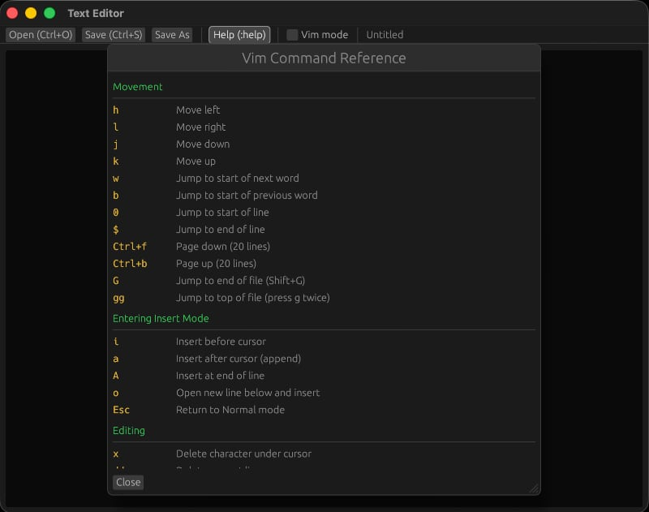

# rust-vim

Simple Rust and Vim GUI Editor

Hyper efficent with essential Vim support

Verified working quicky on even Raspberry Pi 400

Vim toggle and on screen help for learning

Minimal dependencies

Works on Mac and Linux

Run and open file
```
cargo run -- README.md
```



https://www.egui.rs/
